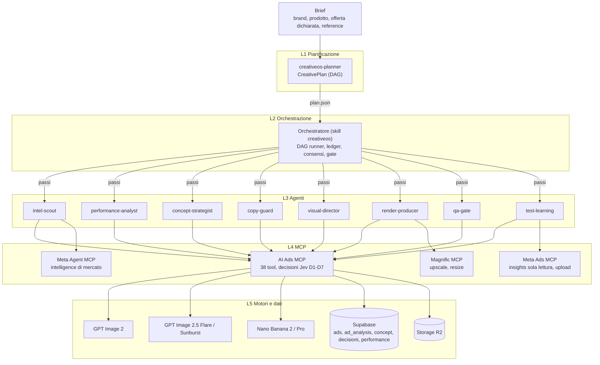
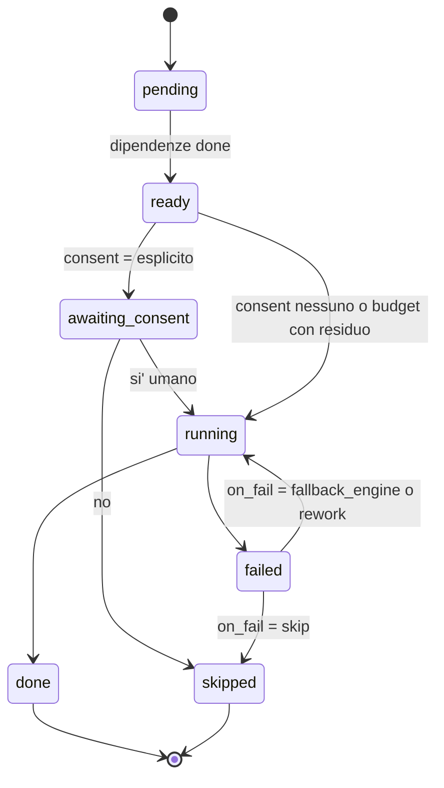
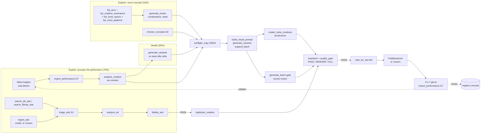
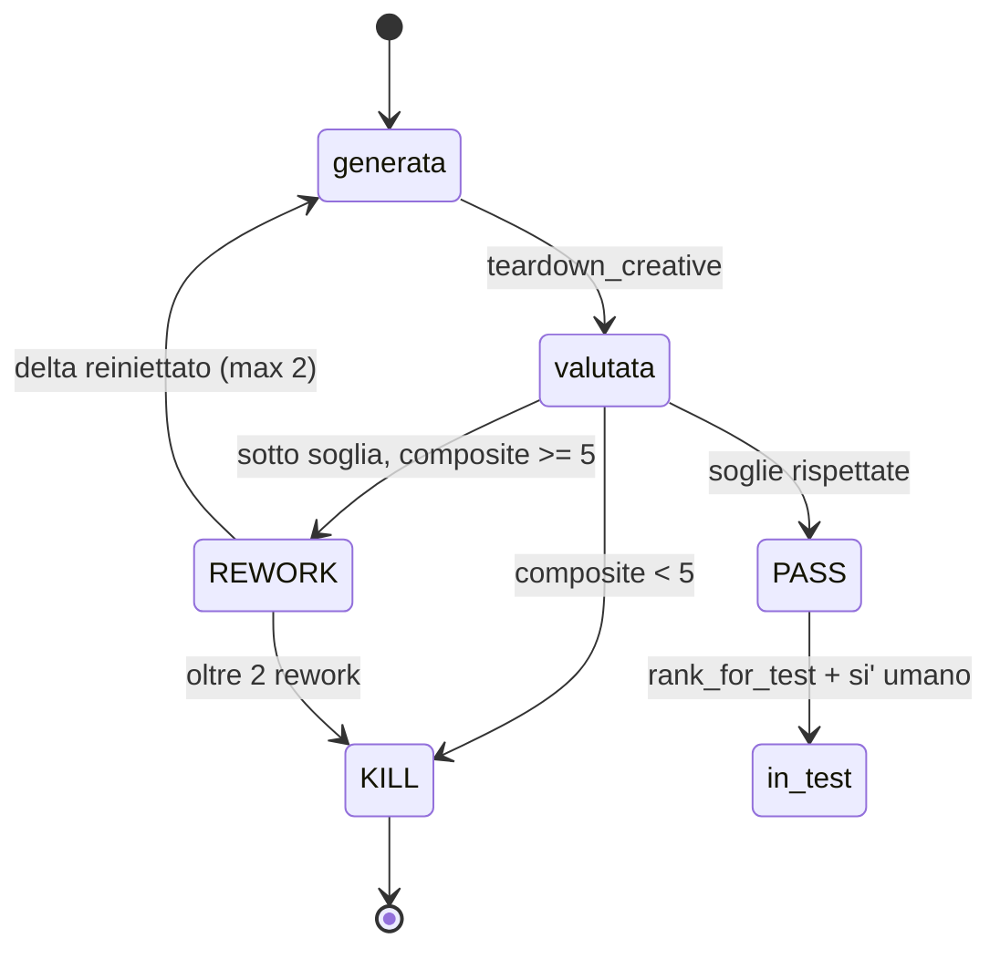
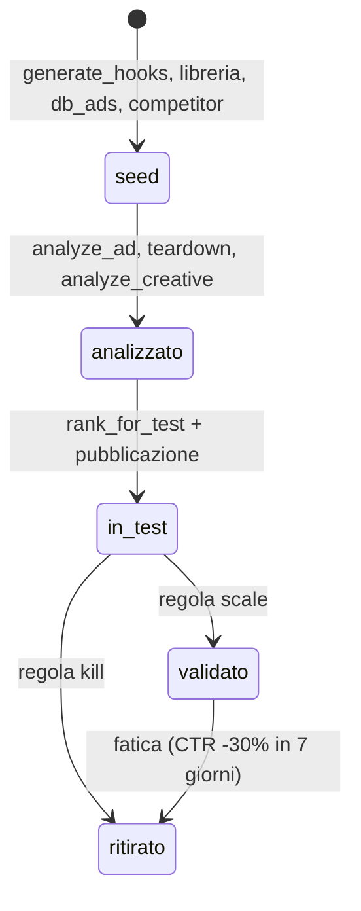
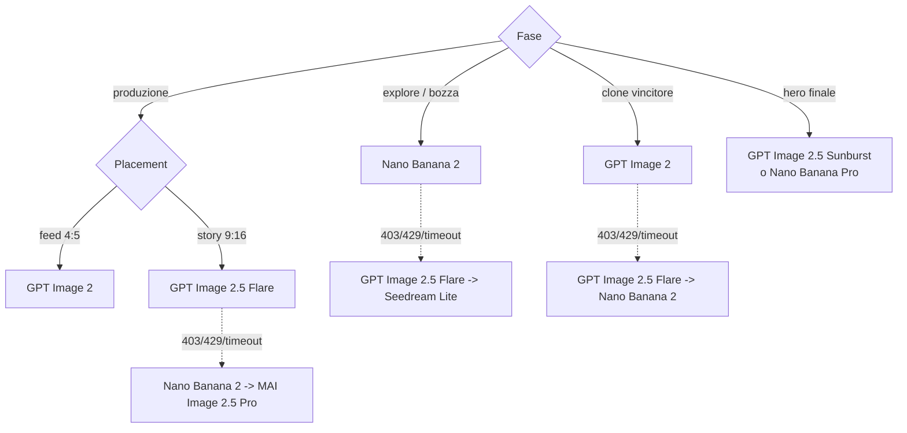
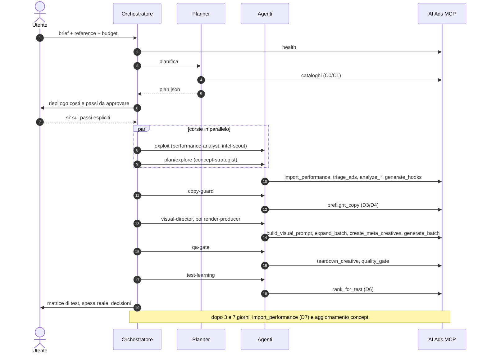

# CreativeOS: architettura

Sistema agentico per pianificare, produrre e testare creative Meta Ads sopra l'MCP **AI Ads** (versione verificata 4.3.1, 38 tool, 16 modelli immagine). Copre tre lavori:

1. **Analisi dei concept che stanno gia' performando**: nell'account del cliente e sul mercato.
2. **Pianificazione dei concept**: arco, meccanica, tattica di hook, voce, formato visivo.
3. **Nuovi concept**: generati, filtrati e renderizzati con GPT Image 2, GPT Image 2.5 (Flare, Sunburst) e Nano Banana.

Il sistema ha tre componenti: un **Planner** che scrive il piano, un **Orchestratore** che lo esegue e un **framework di agenti** specializzati, ognuno con un sottoinsieme dei tool MCP.

---

## 1. Principi

| Principio | Come e' applicato |
|---|---|
| Pianificare prima di spendere | Il Planner usa solo tool C0/C1. Ogni spesa C2, C3 o C4 e' un passo del piano con stima e consenso. |
| Il copy passa dal pre-flight | Ogni hook, da qualsiasi corsia, passa da `preflight_copy` (D3/D4) prima di un render. |
| Reference di brand obbligatoria | Ogni render porta `reference_image`. Il server rifiuta le chiamate senza, prima di spendere. |
| Una variabile alla volta | `generate_variants` cambia un asse per variante; nel torneo la variabile e' il motore. |
| Decisioni tracciabili | D1-D7 scrivono nel registro decisioni del server; `explain_decision` le rilegge. |
| Kill e scale sono codice | Le soglie stanno in `registry/rules.json`, non nel giudizio di un modello. |
| Umano sulle uscite | Ingest a crediti, batch costosi e pubblicazione su Meta richiedono un si' esplicito. |

---

## 2. Vista a strati

| Strato | Componente | File |
|---|---|---|
| L1 | Planner | `.claude/agents/creativeos-planner.md` |
| L2 | Orchestratore | `.claude/skills/creativeos/SKILL.md` |
| L3 | 8 agenti specialisti | `.claude/agents/creativeos-*.md` |
| L4 | Registro tool, costi, consensi | `creativeos/registry/tools.json` |
| L5 | Router motori | `creativeos/registry/engines.json` |
| trasversale | Soglie, portafoglio, kill/scale, ciclo di vita | `creativeos/registry/rules.json` |
| contratti | Piano e ConceptCard | `creativeos/schemas/*.schema.json` |

---

## 3. Planner

Input: brief, `reference_image`, budget. Output: `creativeos/runs/<plan_id>/plan.json` conforme a `schemas/creative-plan.schema.json`.

Il Planner:

1. legge registro, router e regole;
2. chiama `health` ed esclude i tool bloccati (oggi `analyze_ads_batch`: mancano `GOOGLE_API_KEY` e la tabella `analysis_batch_jobs`);
3. divide il budget di render per corsia: **exploit 70%, iterate 20%, explore 10%** (default in `rules.json`);
4. costruisce il DAG: ogni passo ha `agent`, `tool`, `depends_on`, `cost`, `consent`, eventuale `fan_out`, `gate` e `on_fail`;
5. stima il costo e taglia prima explore, poi iterate, mai preflight e gate.

Usa solo tool gratuiti o micro (`list_arcs`, `list_creative_mechanics`, `list_image_models`, `choose_concepts`, `plan_meta_creatives`).

Esempio completo: `creativeos/examples/plan-scalers-plus.json` (24 passi).

---

## 4. Orchestratore

E' la sessione principale di Claude Code con la skill `creativeos`. Esegue il DAG:

Responsabilita':

- **Validazione del piano**: tool esistente e posseduto dall'agente, grafo aciclico, consenso non piu' largo del registro, preflight prima di ogni C3, budget rispettato.
- **Parallelismo**: i passi pronti e indipendenti partono insieme (piu' agenti nello stesso messaggio).
- **Ledger**: riserva la stima prima di un passo C2/C3, registra il costo reale dopo. Sotto 0,50 USD di residuo sospende render e analisi.
- **Ricicli**: preflight non `render` torna allo strategist; REWORK torna al producer (max 2); KILL scarta; fidelity sotto 7 dopo 2 round blocca il clone.
- **Chiusura**: matrice di test, richiamo a 3 e 7 giorni per D7, report con spesa reale e decisioni.

---

## 5. Framework di agenti

| Agente | Modello | Corsia | Tool AI Ads | Satelliti |
|---|---|---|---|---|
| `creativeos-planner` | opus | piano | health, list_verticals, list_image_models, list_arcs, list_creative_mechanics, choose_concepts, plan_meta_creatives | |
| `creativeos-intel-scout` | sonnet | exploit (mercato) | search_db_ads, search_library_ads, list_ads, ingest_ads, ingest_season, triage_ads, analyze_ad, analyze_ads_batch | Meta Agent |
| `creativeos-performance-analyst` | sonnet | exploit (account), iterate | list_ads, import_performance, analyze_creative, analyze_creatives_batch, teardown_creative, explain_decision | |
| `creativeos-concept-strategist` | opus | plan, explore | list_verticals, list_arcs, list_creative_mechanics, list_hook_tactics, list_voice_patterns, list_visual_formats, search_concepts, search_db_ads, list_season_concepts, generate_hooks, choose_concepts, plan_season_creatives | |
| `creativeos-copy-guard` | sonnet | tutte | preflight_copy, explain_decision | |
| `creativeos-visual-director` | sonnet | produzione | list_image_models, list_visual_formats, build_visual_prompt, generate_variants, expand_batch, plan_meta_creatives | |
| `creativeos-render-producer` | sonnet | produzione | create_meta_creatives, generate_batch, generate_image, duplicate_creative | Magnific |
| `creativeos-qa-gate` | sonnet | produzione | teardown_creative, quality_gate, fidelity_test, analyze_creative | |
| `creativeos-test-learning` | sonnet | learn | rank_for_test, import_performance, explain_decision | Meta Ads |

Tutti i 38 tool dell'MCP AI Ads hanno un agente responsabile in `registry/tools.json`. Il test `tests/creativeos-registry.test.mjs` fallisce se un tool resta senza agente o se un agente usa un tool che non possiede.

### Livello decisionale del server (Jev)

| Id | Tool | Cosa decide |
|---|---|---|
| D1 | `triage_ads`, `ingest_season` | Meccanica d'offerta, segnali, consapevolezza; su quali ads spendere analisi vision |
| D2 | `choose_concepts`, `plan_season_creatives` | 3-5 concept di libreria per il brief |
| D3/D4 | `preflight_copy`, `create_meta_creatives`, `plan_season_creatives` | Blocchi deterministici su prezzi, percentuali e date; poi forza dell'hook, brand fit, claim |
| D6 | `rank_for_test` | Ordine delle creative e ad set da 3-5 |
| D7 | `import_performance` | Calibrazione con metriche reali; kill e scale restano regole di codice |

Il server non espone un D5 come tool. Fra D4 e D6 il sistema usa il gate visivo (`teardown_creative` + `quality_gate`).

---

## 6. Le corsie

### 6.1 Exploit: analisi dei concept che performano

**Account del cliente**
1. `test-learning` legge le metriche dal connettore Meta in sola lettura (l'AI Ads non chiama mai la Graph API).
2. `import_performance` (D7) le salva, idempotente su (ad, giorno).
3. `performance-analyst` classifica con `rules.json > performance`: kill, scale, iterate, in attesa.
4. Sui vincitori `analyze_creative` con `performance_data`: ipotesi, miglioramenti, prompt di rework. Per la formula replicabile `teardown_creative`.

**Mercato**
1. Gratis: `search_db_ads` (2622 concept con formula e ad_id clonabile), `search_library_ads` (BFCM 2025, 1.893 ads per spesa UE), segnali Meta Agent (`top_performer_copy`, `creative_intelligence`, `competitor_analysis`).
2. A crediti: `ingest_ads` da BrandSearch, solo con si' umano e `max_credits`.
3. `triage_ads` (D1) sceglie le top-k per mercato e meccanica.
4. `analyze_ad` produce master_prompt, master_idea, master_concept in `ad_analysis`.
5. `fidelity_test` verifica che la formula si riproduca (>= 7). Solo i PASS vanno a `duplicate_creative`.

### 6.2 Plan: pianificazione dei concept

Sequenza dello strategist: **arco** (7) -> **meccanica** (8, per consapevolezza) -> **tattica di hook** (33) -> **voce** (25 template) -> **formato visivo** (70). Per i concept gia' validati: `search_concepts` (104), `list_season_concepts`, `choose_concepts` (D2). Per gli eventi stagionali con offerta dichiarata: `plan_season_creatives`, che esegue D2-D4 e prepara l'input di `create_meta_creatives`.

### 6.3 Explore: nuovi concept

1. `generate_hooks` combina arco e verticale: gratis, istantaneo, riproducibile con `seed`.
2. Lo strategist riscrive l'output. Prova del 2026-10-09 (`ARC-4`, `meta-ads`, seed 42): l'hook contiene "+43% di conversioni" e il body un segnaposto non risolto `{azione_nuova}`. Per questo il pre-flight e' obbligatorio e il preflight blocca cifre non dichiarate.
3. `copy-guard` -> `visual-director` -> **torneo motori**: lo stesso job gira su GPT Image 2, GPT Image 2.5 Flare e Nano Banana 2 con `generate_batch(gate=true)`. Vince il composite piu' alto fra i PASS; a parita' il piu' economico.

### 6.4 Produzione e QA

- Percorso standard: `create_meta_creatives` (preflight, render, analisi, gate >= 8, fino a 2 rework). Solo `approved_creatives` esce.
- Esplorazione: `generate_batch` con gate. Non fa preflight: gli hook arrivano gia' approvati.
- Clone: `duplicate_creative` dopo `fidelity_test`. Dalla libreria condivisa con `source_slug: "libreria"`; nome e logo del brand sorgente non entrano nel prompt.
- Post-produzione delle sole PASS: Magnific `images_upscale`, `design_auto_resize`.

### 6.5 Learn: chiusura del ciclo

`rank_for_test` (D6) compone ad set da 3-5 creative. Dopo la pubblicazione (si' umano) l'orchestratore richiama `import_performance` a 3 e 7 giorni e applica le regole:

`in_test` e' uno stato dell'orchestratore; il server conosce `seed`, `analizzato`, `validato`, `ritirato`. I concept validati rientrano nella corsia exploit del ciclo successivo come base per le varianti.

---

## 7. Router dei motori

| Alias | Id | Provider | Quando |
|---|---|---|---|
| GPT Image 2 | `openai/gpt-image-2` | OpenAI, fallback OpenRouter | Default. Testo in-image preciso: clone dei vincitori, feed 4:5 con copy |
| GPT Image 2.5 Flare | `openai/gpt-image-2.5-flare` | Atlas Cloud | Volume e Stories 9:16 (size libera, latenza dimezzata). Solo se nominato nel piano |
| GPT Image 2.5 Sunburst | `openai/gpt-image-2.5-sunburst` | Atlas Cloud | Hero e foto prodotto rifinite, fino a 16 reference. Solo se nominato nel piano |
| Nano Banana 2 | `google/gemini-3.1-flash-image` | OpenRouter | Esplorazione rapida ed economica; alternativa di `fidelity_test` |
| Nano Banana Pro | `google/gemini-3-pro-image` | OpenRouter | Hero di qualita' massima, fotorealismo di prodotto |

Regole: un errore di provider cambia motore; un verdetto KILL no. Il torneo aggiorna nel tempo quale motore vince per route.

---

## 8. Costi e consensi

| Classe | Cosa | Tool | Consenso |
|---|---|---|---|
| C0 | Gratis | cataloghi, ricerche, `generate_hooks`, `expand_batch`, `build_visual_prompt`, `generate_variants`, `quality_gate`, `plan_meta_creatives`, `import_performance` | nessuno |
| C1 | Decisione Jev | `triage_ads`, `choose_concepts`, `preflight_copy`, `rank_for_test`, `plan_season_creatives` | nessuno |
| C2 | Vision | `analyze_ad`, `analyze_creative`, `teardown_creative`, batch | budget; `analyze_ads_batch` esplicito |
| C3 | Render | `create_meta_creatives`, `generate_batch`, `generate_image`, `duplicate_creative`, `fidelity_test` | budget; i batch grandi esplicito |
| C4 | Crediti BrandSearch | `ingest_ads`, `ingest_season` | esplicito; `ingest_season` anche chiave libreria |

---

## 9. Sequenza tipo

---

## 10. Stato del server al 2026-10-09

- `production_ready: true`, nessun blocker, versione 4.3.1, vision e analisi su `google/gemini-3.8-flash`, storage R2, Supabase attivo.
- Chiavi presenti: OpenRouter, OpenAI diretto, Atlas Cloud (GPT Image 2.5), Luma.
- Avvisi: `analyze_ads_batch` non utilizzabile finche' non si configura `GOOGLE_API_KEY` e si applica `creative_mcp/sql/APPLICA-V43-IN-DASHBOARD.sql` (tabella `analysis_batch_jobs`).
- `analyze_creatives_batch` accetta solo testo: le immagini si analizzano una per volta con `analyze_creative`.

## 11. Rischi

| Rischio | Mitigazione |
|---|---|
| Cifre e segnaposto inventati da `generate_hooks` | Riscrittura dello strategist + `preflight_copy` fail-closed |
| Spesa BrandSearch oltre il previsto (`max_ads_per_brand` fa pagare le righe scartate) | `max_credits`, consenso esplicito, ingest in sequenza |
| Creative fuori brand | `reference_image` obbligatoria, gate >= 8 in produzione |
| Before/after in salute e skincare | Segnalato da qa-gate come rischio policy Meta |
| Confondere spesa UE con performance | Le evidenze di libreria pesano come segnale, non come prova; la prova arriva da D7 |
| Motore non disponibile | Catena alternate/fallback per route |

## 12. Roadmap

1. **Ora**: ciclo manuale in Claude Code con la skill `creativeos` e gli agenti di questa cartella.
2. **Poi**: richiamo automatico di `import_performance` a 3 e 7 giorni come routine pianificata; statistiche del torneo per route salvate su Supabase.
3. **Dopo**: dashboard del ledger e del ciclo di vita dei concept; calibrazione delle regole kill/scale sui dati reali del cliente.
